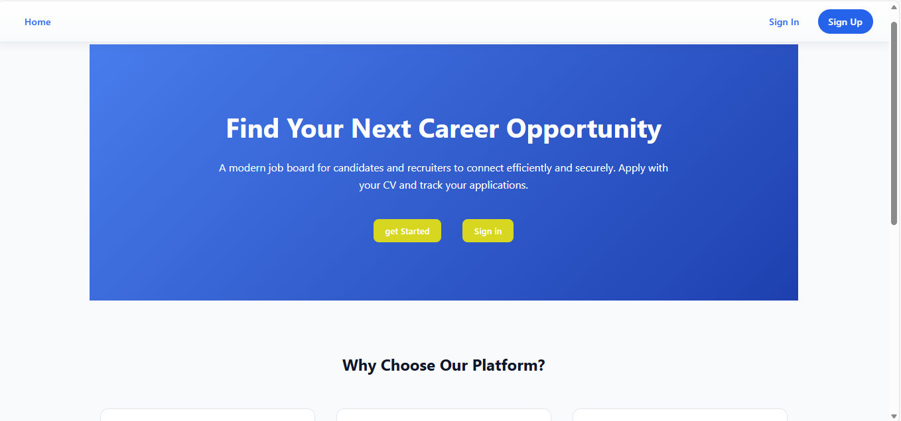

# Job Board Application

## 📸 Screenshot

---

---

## 🧩 App Name
**Job Board**

---

## 📖 Description
Job Board is a modern web application that connects job seekers with recruiters in a simple and intuitive way.  
Candidates can browse available jobs, apply by uploading their CV, and track their applications.  
Recruiters (HR users) can create, edit, and manage job postings, as well as view applicants for each job.

The goal of this project is to demonstrate a full-stack workflow with authentication, role-based access, and a clean, professional user interface.

---

## 🎯 Background
Finding and managing job applications can be confusing for both applicants and recruiters.  
This app was built to simplify that process by providing:
- A clear job listing experience
- A simple application flow
- Separate experiences for HR users and candidates

The UI was designed to feel modern, clean, and easy to use.

---

## 🚀 Getting Started

- **Back-End Repository:**  
  👉 https://github.com/Saeedzxz123/job-board-backend

---

## 🛠️ Technologies Used

- **JavaScript**
- **React**
- **React Router**
- **CSS (custom styling)**
- **REST API**
- **Node.js / Express (Back End)**
- **MongoDB (Database)**
- **JWT Authentication**

---

## 📚 Attributions

- Icons and UI inspiration from modern SaaS dashboards
- Browser default file input behavior
- No copyrighted assets were used

---

## 🔮 Next Steps (Future Enhancements)

- Add job search and filters (location, role, company)
- Add pagination for large job lists
- Allow recruiters to download CVs directly
- Add email notifications for applications
- Improve mobile responsiveness
- Add dark mode

---

## 🔗 Related Repositories

- **Back-End Repository:**  
  https://github.com/Saeedzxz123/job-board-backend
